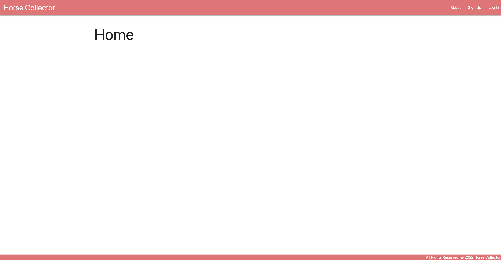
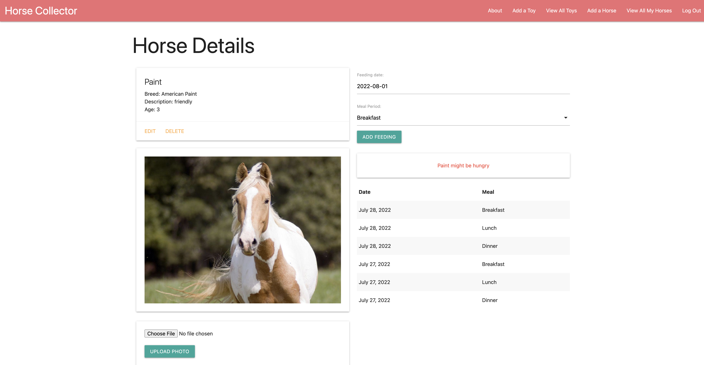
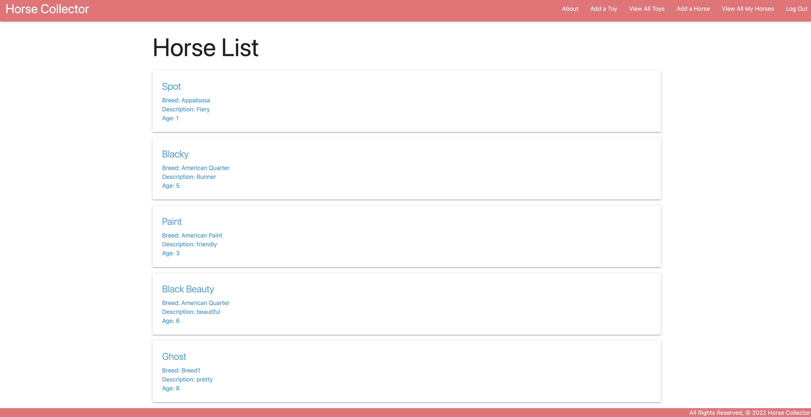
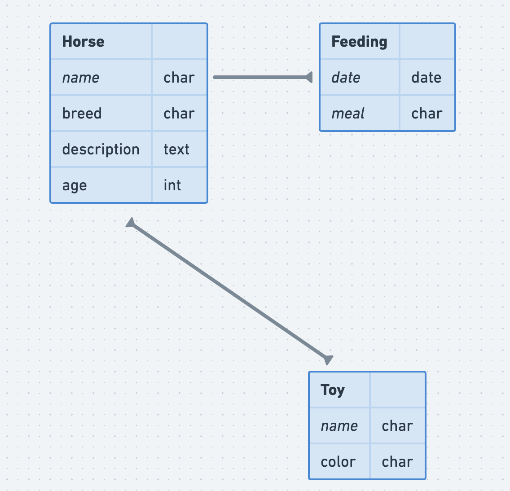

# Horse Collector
The app, Horse Collector, is an app that lets the user collect horses while also being able to feed them and give them toys. I enjoyed going to horse shows when I was a child and I wanted to incoporate my passion for horses into my project.

# User Story
* As a user, I want to be able to add horses to my collection.

* As a user, I want to be able to view some details about horses.

* As a user, I want to be able to feed the horses.

* As a user, I want to be able to give toys to the horses.

* As a user, I want to be able to upload photos of the horses.

# Screenshots

# Technologies Used
* Django
* React

# ERD

# Ice Box
* Get The frontend and the backend to connect
* Be able to leave comments